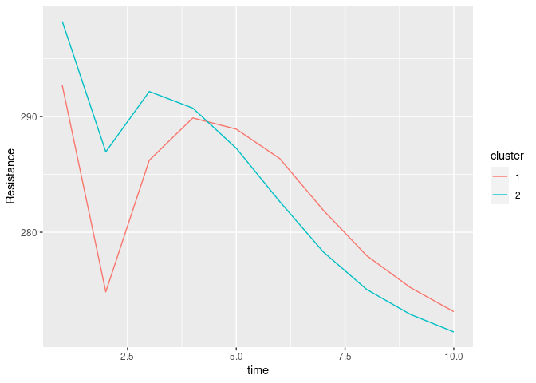
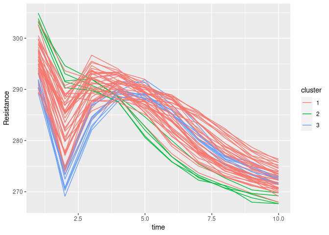
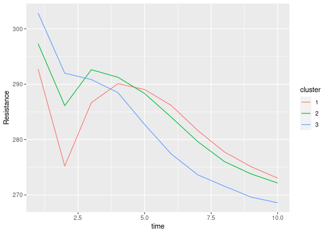

funclustRSW
================

This repository contains R code and data of the paper of Capezza,
Centofanti, Lepore, and Palumbo, “Functional clustering methods for
resistance spot-welding process data in the automotive industry”. This
repository contains the following files:

-   curvclust\_0.0.1.tar.gz is the source code of the R package
    funclust, also available at:
    <https://cran.r-project.org/src/contrib/Archive/curvclust/>
-   data.csv contains the functional data set
-   fclust.R contains functions specific to implement the fclust method
-   functions.R contains functions to apply all functional clustering
    approaches
-   pad\_profiles.csv contains information about the welding tool wear
    level for some of the curves in the functional data set
-   reference\_profile.csv contains a reference dynamic resistance curve
    for illustrative purposes
-   script.R contains the script performing all the analysis shown in
    the paper

Moreover, in the following Section we provide a tutorial to show how to
implement in R all the functional clustering techniques used in Capezza
et al. (2020).

# Functional clustering tutorial

## Introduction

This tutorial shows how to implement the functional clustering
techniques used in Capezza et al. (2020) in R. We assume original data
are available as a matrix of discrete data observed on a regular,
equally-spaced grid. It requires the following files:

-   `fclust.R` to implement `fclust` (James and Sugar (2003)),
-   `functions.R` to fit all other functional clustering methods used in
    Capezza et al. (2020).

Moreover, this code uses the data from the file `data.csv`, which
contains the data set analyzed in Capezza et al. (2020). Alternatively,
one can use another data set that must be arranged appropriately as in
the next section “Data preparation”.

For each functional clustering method, we show how to perform the
following steps:

1.  model fitting
2.  selection of the number of clusters
3.  plot of profiles coloured by cluster
4.  plot of cluster centroids

### Data preparation

Note that the `curvclust` R package was removed from CRAN, then we
provide the source file for local installation, from source.

``` r
if (!("curvclust" %in% installed.packages())) {
  install.packages("./curvclust_0.0.1.tar.gz", repos = NULL, type="source")
}
library(curvclust)
library(tidyverse)
library(parallel)
library(fda.usc)
library(clValid)
library(funHDDC)
library(NbClust)
library(mclust)
library(factoextra)

source("fclust.R")
source("functions.R")
```

The input to the analysis is a list of two objects:

-   `X`, a matrix with dimension *n* × *p*, where *n* is the number of
    profiles and *p* is the number of grid points over which data are
    observed
-   `grid`, a numeric vector with length *p* with the grid points at
    which data are observed.

For simplicity, here we work with a subset of the data set used in
Capezza et al. (2020). We also sample all profiles on a small subset of
domain points.

``` r
df <- read.csv("data.csv")
X <- df[seq(from = 1, to = 238, by = 25), seq(from = 2, to = ncol(df), by = 10)]
X <- as.matrix(X)
n_obs <- ncol(X)
n_point <- nrow(X)
grid <- seq(from = 0, to = 1, length.out = n_point)
data <- list(X = X, grid = grid)
```

Plotting data can be made easy using R packages in the `tidyverse`
(i.e., `ggplot2` and `tidyr`), once data are put in the long format.

``` r
df_long <- data$X %>%
  as.data.frame %>%
  mutate(grid = data$grid) %>%
  pivot_longer(-grid, names_to = "observation")
df_long
```

    ## # A tibble: 540 x 3
    ##     grid observation value
    ##    <dbl> <chr>       <dbl>
    ##  1     0 X1           289.
    ##  2     0 X11          296.
    ##  3     0 X21          297.
    ##  4     0 X31          290.
    ##  5     0 X41          303.
    ##  6     0 X51          295.
    ##  7     0 X61          301.
    ##  8     0 X71          300.
    ##  9     0 X81          294.
    ## 10     0 X91          300.
    ## # … with 530 more rows

``` r
ggplot(df_long) +
  geom_line(mapping = aes(x = grid, y = value, group = observation))
```

<!-- -->

In the following, we show how to perform all functional clustering
approaches.

``` r
num_cluster_seq <- 2:4
ncores <- 1
```

## Adaptive clustering

### fclust (James and Sugar (2003))

#### Model fitting

``` r
mod1 <- fit_fclust_ms(data = data, 
                      num_cluster_seq = num_cluster_seq, 
                      dim_seq = c(5, 10), 
                      ncores = ncores)
```

#### Selection of the number of clusters

To select the number of clusters, we can use the Bayesian information
criterion (BIC). The function `fit_fclust_ms` already provides the
cluster assignment corresponding to the optimal number of clusters
accordin to BIC.

``` r
mod1$class_opt_BIC
```

    ##  [1] 1 2 1 1 2 1 2 1 2 2 1 2 1 1 1 2 2 2 2 2 2 2 1 1 2 2 2 1 2 1 1 1 1 2 1 1 2 1
    ## [39] 2 1 1 1 2 2 1 1 1 1 2 1 2 1 2 2

#### Plot of profiles coloured by cluster

``` r
cl_1 <- mod1$class_opt_BIC

clustered_funs1 <- get_clustered_funs_df(cl = cl_1, 
                                         data = data, 
                                         method = "adaptive\nfunHDDC")
ggplot(clustered_funs1) +
  geom_line(aes(time, Resistance, group = obs, col = cluster))
```

<!-- -->

#### Plot of cluster centroids

``` r
centroids1 <- get_centroids_df(cl = cl_1, 
                               data = data, 
                               method = "adaptive\nfunHDDC")
ggplot(centroids1) +
  geom_line(aes(time, Resistance, col = cluster))
```

<!-- -->

### curvclust (Giacofci et al. (2013))

#### Model fitting

We consider several combinations of possible parameters that allow to
select different structures for the covariance matrix. Then, we perform
clustering for each structure. In the following, we only consider a
subset of the possible structures by commenting lines of code.

``` r
parameters <- expand.grid(
  structures = c(
    "constant",
    # "group",
    # "scale.location",
    # "group.scale.location",
    "none"
    ), 
  mixed = c(
    # TRUE, 
    FALSE
    ), 
  reduction = c(
    TRUE,
    FALSE
    )
  ) %>% 
  filter(!(structures == "none" & mixed),
         !(structures != "none" & !mixed)) %>% 
  mutate(structures = as.character(structures))
```

Here we only initialize a named list with the selected structures.

``` r
mod2 <- vector(mode = "list", length = nrow(parameters))
names(mod2) <- sapply(1:nrow(parameters), function(ii) {
  parameters[ii,] %>%
    mutate(structures = paste0("structure_", structures),
           mixed = paste0("mixed_", mixed),
           reduction = paste0("reduction_", reduction)) %>%
    paste0(collapse = " ")
})
mod2
```

    ## $`structure_none mixed_FALSE reduction_TRUE`
    ## NULL
    ## 
    ## $`structure_none mixed_FALSE reduction_FALSE`
    ## NULL

Then we fill elements of `mod2` with the fitted models

``` r
for (ii in 1:nrow(parameters)) {
  mod2[[ii]] <- curvclust_ms(data=data,
                             num_cluster_seq = c(1, num_cluster_seq),
                             structure = parameters$structures[ii],
                             mixed = parameters$mixed[ii], 
                             reduction = parameters$reduction[ii])
}
```

#### Selection of the number of clusters

In this particular approach, the output does not provide any indication
on the number of clusters to select. However, we can use BIC.

``` r
bic <- sapply(mod2, function(x) x$BIC)
bic
```

    ##      structure_none mixed_FALSE reduction_TRUE
    ## [1,]                                  1453.071
    ## [2,]                                  1469.700
    ## [3,]                                  1386.544
    ## [4,]                                  1315.170
    ##      structure_none mixed_FALSE reduction_FALSE
    ## [1,]                                   1663.839
    ## [2,]                                   1733.597
    ## [3,]                                   1632.961
    ## [4,]                                   1548.261

We can plot BIC for every number of clusters and every structure by
arranging the matrix of BIC values in a long-format data frame and then
using ggplot2. Note that the convention used in the `curvclust` package
is that the larger the BIC the better.

``` r
bic_df_long <- bic %>% 
  as.data.frame %>% 
  mutate(K = c(1, num_cluster_seq)) %>% 
  pivot_longer(- K, values_to = "BIC", names_to = "model")
bic_df_long
```

    ## # A tibble: 8 x 3
    ##       K model                                        BIC
    ##   <dbl> <chr>                                      <dbl>
    ## 1     1 structure_none mixed_FALSE reduction_TRUE  1453.
    ## 2     1 structure_none mixed_FALSE reduction_FALSE 1664.
    ## 3     2 structure_none mixed_FALSE reduction_TRUE  1470.
    ## 4     2 structure_none mixed_FALSE reduction_FALSE 1734.
    ## 5     3 structure_none mixed_FALSE reduction_TRUE  1387.
    ## 6     3 structure_none mixed_FALSE reduction_FALSE 1633.
    ## 7     4 structure_none mixed_FALSE reduction_TRUE  1315.
    ## 8     4 structure_none mixed_FALSE reduction_FALSE 1548.

``` r
ggplot(bic_df_long) +
  geom_line(aes(K, BIC, col = model))
```

<!-- -->

The optimal number of clusters is

``` r
bic_opt <- filter(bic_df_long, BIC == max(BIC))
Kopt <- bic_opt$K
Kopt
```

    ## [1] 2

#### Plot of profiles coloured by cluster

``` r
## mod2 curvclust
mod2_opt <- mod2[[bic_opt$model]]
cl_2 <- mod2_opt$class[[Kopt]]

clustered_funs2 <- get_clustered_funs_df(cl = cl_2, 
                                         data = data, 
                                         method = "adaptive\ncurvclust")
ggplot(clustered_funs2) +
  geom_line(aes(time, Resistance, group = obs, col = cluster))
```

<!-- -->

#### Plot of cluster centroids

``` r
centroids2 <- get_centroids_df(cl = cl_2, 
                               data = data, 
                               method = "adaptive\ncurvclust")
ggplot(centroids2) +
  geom_line(aes(time, Resistance, col = cluster))
```

<!-- -->

### funHDDC (Bouveyron and Jacques (2011))

#### Model fitting

In the following, we only consider a subset of the possible models by
commenting lines of code.

``` r
mod3 <- fit_funHDDC_ms(data = data,
                       num_cluster_seq = num_cluster_seq,
                       model = c('AkjBkQkDk',
                                 'AkjBQkDk'
                                 # 'AkBkQkDk',
                                 # 'ABkQkDk',
                                 # 'AkBQkDk',
                                 # 'ABQkDk'), 
                       ),
                       threshold_seq = c(.5, .9),
                       nb.rep = 20)
```

#### Selection of the number of clusters

The optimal number of clusters is selected using the BIC criterion and
is

``` r
mod3$mod_opt$K
```

    ## [1] 3

#### Plot of profiles coloured by cluster

``` r
cl_3 <- mod3$mod$class

clustered_funs3 <- get_clustered_funs_df(cl = cl_3, 
                                         data = data, 
                                         method = "adaptive\nfunHDDC")
ggplot(clustered_funs3) +
  geom_line(aes(time, Resistance, group = obs, col = cluster))
```

<!-- -->

#### Plot of cluster centroids

``` r
centroids3 <- get_centroids_df(cl = cl_3, 
                               data = data, 
                               method = "adaptive\nfunHDDC")
ggplot(centroids3) +
  geom_line(aes(time, Resistance, col = cluster))
```

<!-- -->

## Distance-based clustering

#### Model fitting

The distance-based clustering can be performed using the R package
`fda.usc`.

``` r
mod4 <- distance_ms(data = data, num_cluster_seq = num_cluster_seq, met = "other")
```

#### Selection of the number of clusters

We can use several criteria to select the number of cluster, here we use
the silhouette index, which select a number of clusters equal to:

``` r
mod4$sil_opt
```

    ## [1] 2

#### Plot of profiles coloured by cluster

``` r
cl_4 <- mod4$mod_opt_sil$clus

clustered_funs4 <- get_clustered_funs_df(cl = cl_4, 
                                         data = data, 
                                         method = "distance-based")
ggplot(clustered_funs4) +
  geom_line(aes(time, Resistance, group = obs, col = cluster))
```

<!-- -->

#### Plot of cluster centroids

``` r
centroids4 <- get_centroids_df(cl = cl_4, 
                               data = data, 
                               method = "distance-based")
ggplot(centroids4) +
  geom_line(aes(time, Resistance, col = cluster))
```

<!-- -->

## Filtering methods

For For B-spline, FPCA (and also for raw-data clustering in the next
section), one single function provides k-means, hierarchical and
model-based clustering. The number of clusters for k-means and
hierarchical clustering is selected using the majority rule on the basis
of multiple criteria, via the `NbClust` package

### B-spline basis

#### Model fitting

``` r
mod5 <- fil_bspline_ms_nclust(data = data, num_cluster_seq = num_cluster_seq, nbasis = 5)
```

#### Selection of the number of clusters

The optimal number of clusters is given by

``` r
mod5$mod_opt$ind_hc$nbclust ## hierarchical
```

    ## [1] 2

``` r
max(mod5$mod_opt$ind_km$cluster) ## k-means
```

    ## [1] 2

``` r
mod5$mod_opt$mod_opt$G ## model-based
```

    ## [1] 4

#### Plot of profiles coloured by cluster

``` r
cl_5_hc <- mod5$mod_opt$ind_hc$cluster
cl_5_km <- mod5$mod_opt$ind_km$cluster
cl_5_mb <- mod5$mod_opt$mod_opt$classification

clustered_funs5_hc <- get_clustered_funs_df(cl = cl_5_hc, 
                                         data = data, 
                                         method = "filtering B-spline\nhierarchical")
ggplot(clustered_funs5_hc) +
  geom_line(aes(time, Resistance, group = obs, col = cluster))
```

<!-- -->

``` r
clustered_funs5_km <- get_clustered_funs_df(cl = cl_5_km, 
                                         data = data, 
                                         method = "filtering B-spline\nk-means")
ggplot(clustered_funs5_km) +
  geom_line(aes(time, Resistance, group = obs, col = cluster))
```

<!-- -->

``` r
clustered_funs5_mb <- get_clustered_funs_df(cl = cl_5_mb, 
                                         data = data, 
                                         method = "filtering B-spline\nmodel-based")
ggplot(clustered_funs5_mb) +
  geom_line(aes(time, Resistance, group = obs, col = cluster))
```

<!-- -->

#### Plot of cluster centroids

``` r
centroids5_hc <- get_centroids_df(cl_5_hc, data, "filtering B-spline\nhierarchical")
centroids5_km <- get_centroids_df(cl_5_km, data, "filtering B-spline\nk-means")
centroids5_mb <- get_centroids_df(cl_5_mb, data, "filtering B-spline\nmodel-based")

ggplot(centroids5_hc) +
  geom_line(aes(time, Resistance, col = cluster))
```

<!-- -->

``` r
ggplot(centroids5_km) +
  geom_line(aes(time, Resistance, col = cluster))
```

<!-- -->

``` r
ggplot(centroids5_mb) +
  geom_line(aes(time, Resistance, col = cluster))
```

<!-- -->

### FPCA basis

#### Model fitting

``` r
mod6 <- fil_fpca_ss_nbclust(data = data, num_cluster_seq = num_cluster_seq, per_comp = 0.8)
```

#### Selection of the number of clusters

The optimal number of clusters is given by

``` r
mod6$mod_opt$ind_hc$nbclust ## hierarchical
```

    ## [1] 3

``` r
max(mod6$mod_opt$ind_km$cluster) ## k-means
```

    ## [1] 3

``` r
mod6$mod_opt$mod_opt$G ## model-based
```

    ## [1] 2

#### Plot of profiles coloured by cluster

``` r
cl_6_km <- mod6$mod_opt$ind_km$cluster
cl_6_hc <- mod6$mod_opt$ind_hc$cluster
cl_6_mb <- mod6$mod_opt$mod_opt$classification

clustered_funs6_hc <- get_clustered_funs_df(cl = cl_6_hc, 
                                         data = data, 
                                         method = "filtering FPCA\nhierarchical")
ggplot(clustered_funs6_hc) +
  geom_line(aes(time, Resistance, group = obs, col = cluster))
```

<!-- -->

``` r
clustered_funs6_km <- get_clustered_funs_df(cl = cl_6_km, 
                                         data = data, 
                                         method = "filtering FPCA\nk-means")
ggplot(clustered_funs6_km) +
  geom_line(aes(time, Resistance, group = obs, col = cluster))
```

<!-- -->

``` r
clustered_funs6_mb <- get_clustered_funs_df(cl = cl_6_mb, 
                                         data = data, 
                                         method = "filtering FPCA\nmodel-based")
ggplot(clustered_funs6_mb) +
  geom_line(aes(time, Resistance, group = obs, col = cluster))
```

<!-- -->

#### Plot of cluster centroids

``` r
centroids6_hc <- get_centroids_df(cl_6_hc, data, "filtering FPCA\nhierarchical")
centroids6_km <- get_centroids_df(cl_6_km, data, "filtering FPCA\nk-means")
centroids6_mb <- get_centroids_df(cl_6_mb, data, "filtering FPCA\nmodel-based")

ggplot(centroids6_hc) +
  geom_line(aes(time, Resistance, col = cluster))
```

<!-- -->

``` r
ggplot(centroids6_km) +
  geom_line(aes(time, Resistance, col = cluster))
```

<!-- -->

``` r
ggplot(centroids6_mb) +
  geom_line(aes(time, Resistance, col = cluster))
```

<!-- -->

## Raw-data clustering

#### Model fitting

``` r
mod7 <- raw_ms_nbclust(data = data, num_cluster_seq = num_cluster_seq)
```

#### Selection of the number of clusters

The optimal number of clusters is given by

``` r
mod7$mod_opt$ind_hc$nbclust ## hierarchical
```

    ## [1] 3

``` r
max(mod7$mod_opt$ind_km$cluster) ## k-means
```

    ## [1] 3

``` r
mod7$mod_opt$mod_opt$G ## model-based
```

    ## [1] 1

#### Plot of profiles coloured by cluster

``` r
cl_7_km <- mod7$mod_opt$ind_km$cluster
cl_7_hc <- mod7$mod_opt$ind_hc$cluster
cl_7_mb <- mod7$mod_opt$mod_opt$classification

clustered_funs7_hc <- get_clustered_funs_df(cl = cl_7_hc, 
                                         data = data, 
                                         method = "raw-data\nhierarchical")
ggplot(clustered_funs7_hc) +
  geom_line(aes(time, Resistance, group = obs, col = cluster))
```

<!-- -->

``` r
clustered_funs7_km <- get_clustered_funs_df(cl = cl_7_km, 
                                         data = data, 
                                         method = "raw-data\nk-means")
ggplot(clustered_funs7_km) +
  geom_line(aes(time, Resistance, group = obs, col = cluster))
```

<!-- -->

``` r
clustered_funs7_mb <- get_clustered_funs_df(cl = cl_7_mb, 
                                         data = data, 
                                         method = "raw-data\nmodel-based")
ggplot(clustered_funs7_mb) +
  geom_line(aes(time, Resistance, group = obs, col = cluster))
```

<!-- -->

#### Plot of cluster centroids

``` r
centroids7_hc <- get_centroids_df(cl_7_hc, data, "filtering raw-data\nhierarchical")
centroids7_km <- get_centroids_df(cl_7_km, data, "filtering raw-data\nk-means")
centroids7_mb <- get_centroids_df(cl_7_mb, data, "filtering raw-data\nmodel-based")

ggplot(centroids7_hc) +
  geom_line(aes(time, Resistance, col = cluster))
```

<!-- -->

``` r
ggplot(centroids7_km) +
  geom_line(aes(time, Resistance, col = cluster))
```

<!-- -->

``` r
ggplot(centroids7_mb) +
  geom_line(aes(time, Resistance, col = cluster))
```

<!-- -->

# References

-   Bouveyron C, Jacques J (2011) Model-based clustering of time series
    in group-specific functional subspaces. *Advances in Data Analysis
    and Classification*. 5(4): 281–300.
-   Capezza C, Centofanti F, Lepore A, Palumbo B (2020) Functional
    clustering methods for resistance spot welding process data in the
    automotive industry. Preprint arXiv:2007.09128.
-   James GM, Sugar CA (2003) Clustering for sparsely sampled functional
    data. *Journal of the American Statistical Association*.
    98(462):397—408.
-   Giacofci M, Lambert-Lacroix S, Marot G, Picard F (2013)
    Wavelet-based clustering for mixed-effects functional models in high
    dimension. *Biometrics* 2013; 69(1):31—40.
